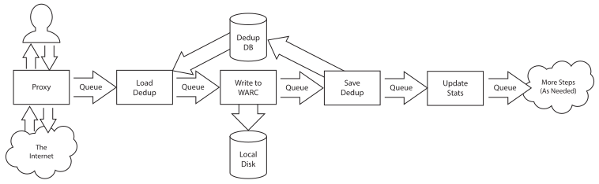

Warcprox - WARC writing MITM HTTP/S proxy
*****************************************

Warcprox is an HTTP proxy designed for web archiving applications. When used in
parallel with `brozzler <https://github.com/internetarchive/brozzler>`_ it
supports a comprehensive, modern, and distributed archival web capture system.
Warcprox stores its traffic to disk in the `Web ARChive (WARC) file format
<https://iipc.github.io/warc-specifications/specifications/warc-format/warc-1.1/>`_,
which may then be accessed with web archival replay software like `OpenWayback
<https://github.com/iipc/openwayback>`_ and `pywb
<https://github.com/webrecorder/pywb>`_. It captures encrypted HTTPS traffic by
using the "man-in-the-middle" technique (see the `Man-in-the-middle`_ section
for more info).

Warcprox was originally based on `pymiproxy
<https://github.com/allfro/pymiproxy>`_ by Nadeem Douba.

.. contents::

Getting started
===============
Warcprox runs on python 3.4+.

To install latest release run::

    # apt-get install libffi-dev libssl-dev
    pip install warcprox

You can also install the latest bleeding edge code::

    pip install git+https://github.com/internetarchive/warcprox.git

To start warcprox run::

    warcprox

Try ``warcprox --help`` for documentation on command line options.

Man-in-the-middle
=================
Normally, HTTP proxies can't read encrypted HTTPS traffic. The browser uses the
HTTP ``CONNECT`` method to establish a tunnel through the proxy, and the proxy
merely routes raw bytes between the client and server. Since the bytes are
encrypted, the proxy can't make sense of the information that it proxies. This
nonsensical encrypted data is not typically useful for web archiving purposes.

In order to capture HTTPS traffic, warcprox acts as a "man-in-the-middle"
(MITM). When it receives a ``CONNECT`` directive from a client, it generates a
public key certificate for the requested site, presents to the client, and
proceeds to establish an encrypted connection with the client. It then makes a
separate, normal HTTPS connection to the remote site. It decrypts, archives,
and re-encrypts traffic in both directions.

Configuring a warcprox instance as a browser’s HTTP proxy will result in
security certificate warnings because none of the certificates will be signed
by trusted authorities. However, there is nothing malicious about warcprox
functions. To use warcprox effectively, the client needs to disable certificate
verification or add the CA certificate generated by warcprox as a trusted
authority. When using the latter, remember to undo this change when finished
using warcprox.

API
===
The warcprox API may be used to retrieve information from and interact with a
running warcprox instance, including:

* Retrieving status information via ``/status`` URL
* Writing WARC records via ``WARCPROX_WRITE_RECORD`` HTTP method
* Controlling warcprox settings via the ``Warcprox-Meta`` HTTP header

For warcprox API documentation, see: `<api.rst>`_.

Deduplication
=============
Warcprox avoids archiving redundant content by "deduplicating" it. The process
for deduplication works similarly to deduplication by `Heritrix
<https://github.com/internetarchive/heritrix3>`_ and other web archiving tools:

1. While fetching URL, calculate payload content digest (typically SHA1
   checksum value)
2. Look up digest in deduplication database (warcprox currently supports
   `sqlite <https://sqlite.org/>`_ by default, `rethinkdb
   <https://github.com/rethinkdb/rethinkdb>`_ with two different schemas, and
   `trough <https://github.com/internetarchive/trough>`_)
3. If found, write warc ``revisit`` record referencing the url and capture time
   of the previous capture
4. If not found,

   a. Write ``response`` record with full payload
   b. Store new entry in deduplication database (can be disabled, see
      `Warcprox-Meta HTTP request header <api.rst#warcprox-meta-http-request-header>`_)

The deduplication database is partitioned into different "buckets". URLs are
deduplicated only against other captures in the same bucket. If specified, the
``dedup-buckets`` field of the `Warcprox-Meta HTTP request header
<api.rst#warcprox-meta-http-request-header>`_ determines the bucket(s). Otherwise,
the default bucket is used.

Deduplication can be disabled entirely by starting warcprox with the argument
``--dedup-db-file=/dev/null``.

Statistics
==========
Warcprox stores some crawl statistics to sqlite or rethinkdb. These are
consulted for enforcing ``limits`` and ``soft-limits`` (see `Warcprox-Meta
fields <api.rst#warcprox-meta-fields>`_), and can also be consulted by other
processes outside of warcprox, such as for crawl job reporting.

Statistics are grouped by "bucket". Every capture is counted as part of the
``__all__`` bucket. Other buckets can be specified in the ``Warcprox-Meta``
request header. The fallback bucket in case none is specified is called
``__unspecified__``.

Within each bucket are three sub-buckets:

* ``new`` - tallies captures for which a complete record (usually a
  ``response`` record) was written to a WARC file
* ``revisit`` - tallies captures for which a ``revisit`` record was written to
  a WARC file
* ``total`` - includes all URLs processed, even those not written to a WARC
  file, and so may be greater than the sum of new and revisit records

Within each of these sub-buckets, warcprox generates two kinds of statistics:

* ``urls`` - simple count of URLs
* ``wire_bytes`` - sum of bytes received over the wire from the remote server
  for each URL, including HTTP headers

For historical reasons, the default sqlite store keeps statistics as JSON blobs::

    sqlite> select * from buckets_of_stats;
    bucket           stats
    ---------------  ---------------------------------------------------------------------------------------------
    __unspecified__  {"bucket":"__unspecified__","total":{"urls":37,"wire_bytes":1502781},"new":{"urls":15,"wire_bytes":1179906},"revisit":{"urls":22,"wire_bytes":322875}}
    __all__          {"bucket":"__all__","total":{"urls":37,"wire_bytes":1502781},"new":{"urls":15,"wire_bytes":1179906},"revisit":{"urls":22,"wire_bytes":322875}}

Plugins
=======
Warcprox supports a limited notion of plugins by way of the ``--plugin``
command line argument. Plugin classes are loaded from the regular python module
search path. They are instantiated with one argument that contains the values
of all command line arguments, ``warcprox.Options``. Legacy plugins with
constructors that take no arguments are also supported. Plugins should either
have a method ``notify(self, recorded_url, records)`` or should subclass
``warcprox.BasePostfetchProcessor``. More than one plugin can be configured by
specifying ``--plugin`` multiples times.

See a minimal example `here
<https://github.com/internetarchive/warcprox/blob/318405e795ac0ab8760988a1a482cf0a17697148/warcprox/__init__.py#L165>`__.

Architecture
============

Warcprox is multithreaded. It has pool of http proxy threads (100 by default).
When handling a request, a proxy thread records data from the remote server to
an in-memory buffer that spills over to disk if necessary (after 512k by
default), while it streams the data to the proxy client. Once the HTTP
transaction is complete, it puts the recorded URL in a thread-safe queue, to be
picked up by the first processor in the postfetch chain.

The postfetch chain normally includes processors for loading deduplication
information, writing records to the WARC, saving deduplication information, and
updating statistics. The exact set of processors in the chain depends on
command line arguments; for example, plugins specified with ``--plugin`` are
processors in the postfetch chain. Each postfetch processor has its own thread
or threads. Thus the processors are able to run in parallel, independent of one
another. This design also enables them to process URLs in batch. For example,
the statistics processor gathers statistics for up to 10 seconds or 500 URLs,
whichever comes first, then updates the statistics database with just a few
queries.

License
=======

Warcprox is a derivative work of pymiproxy, which is GPL. Thus warcprox is also
GPL.

* Copyright (C) 2012 Cygnos Corporation
* Copyright (C) 2013-2018 Internet Archive

This program is free software; you can redistribute it and/or
modify it under the terms of the GNU General Public License
as published by the Free Software Foundation; either version 2
of the License, or (at your option) any later version.

This program is distributed in the hope that it will be useful,
but WITHOUT ANY WARRANTY; without even the implied warranty of
MERCHANTABILITY or FITNESS FOR A PARTICULAR PURPOSE.  See the
GNU General Public License for more details.

You should have received a copy of the GNU General Public License
along with this program; if not, write to the Free Software
Foundation, Inc., 51 Franklin Street, Fifth Floor, Boston, MA  02110-1301, USA.

